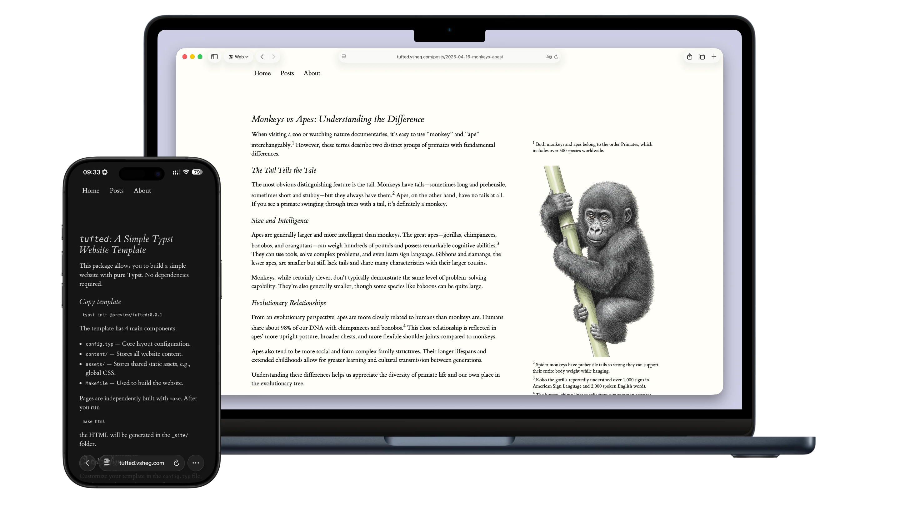

# Tufted Blog Template

<div align="center">

[](https://github.com/Yousa-Mirage/Tufted-Blog-Template/stargazers)
[](https://opensource.org/licenses/MIT)
[](https://deepwiki.com/Yousa-Mirage/Tufted-Blog-Template)
[](https://typst.app/)

[简体中文](README.md) | [English](README_en.md)

</div>

这是一个基于 [Typst](https://typst.app/) 和 [Tufted](https://github.com/vsheg/tufted) 的静态网站构建模板，手把手教你搭建简洁、美观的个人网站、博客和简历设计。

如果你想快速体验网站样式效果，可以访问 [示例网站](https://tufted-blog.pages.dev/) 。
更新记录可见 [Changelog](CHANGELOG.md) 。



> 遇到不懂的概念或不会的操作，多看文档、多问 AI、多搜索。  
> 如果遇到任何问题，你可以：查看 [Wiki 文档](https://github.com/Yousa-Mirage/Tufted-Blog-Template/wiki)、询问 [DeepWiki](https://deepwiki.com/Yousa-Mirage/Tufted-Blog-Template)、在 [Discussions](https://github.com/Yousa-Mirage/Tufted-Blog-Template/discussions) 中提问和讨论、在 [Issue](https://github.com/Yousa-Mirage/Tufted-Blog-Template/issues) 中提交反馈。

## 特点

- 使用 Typst 编写内容，简洁强大，编译极快
- 基于 Tufte CSS 设计，极简主义、内容至上，提供清晰、沉浸的阅读体验
- 内置基于 Python 的跨平台构建脚本，支持增量编译
- 支持生成 HTML 网页和 PDF 文档，支持链接到 PDF
- 内置 GitHub Actions 工作流，一键部署网站
- 支持浅色/深色模式自动选择和一键切换 
- 丰富的示例和文档，无需任何前置知识，[简单学习 Typst](https://github.com/Yousa-Mirage/Tufted-Blog-Template/wiki/Typst-%E5%BF%AB%E9%80%9F%E5%85%A5%E9%97%A8%E8%B5%84%E6%96%99) 后即可开始编写

## 环境准备

本项目只依赖 Typst 和 Python（推荐使用 uv 配置 Python），其中Typst 用于编译网页，Python 脚本用于自动化构建流程。

## 日常使用流程

整个模板工作流程如下所示：

```plaintext
使用本模板创建你的 GitHub 仓库 
  ↓
将你的仓库克隆到本地
  ↓
按自己的意愿，参考模板修改 .typ 文件
  ↓
命令行输入 python build.py build 增量编译
  ↓
命令行输入 python build.py preview 本地预览查看效果
（推荐另开一个终端）
  ↓
满意后命令行输入 git add ., commit, push 到你的 GitHub 仓库
  ↓
GitHub Actions 自动部署至 username.github.io 
```

## 📂 项目结构

```plaintext
Tufted-Blog-Template/
├── .github/workflows      # GitHub Actions 自动构建、部署
├── _site/                 # 构建输出目录 (自动生成)
├── assets/                # 静态资源 (CSS、JS、字体、图标等)
│   ├── tufted.css             # 主样式表
│   ├── custom.css             # 自定义样式表（用户可编辑）
│   ├── copy-code.js           # 代码块复制功能
│   ├── line-numbers.js        # 代码行号显示
│   └── format-headings.js     # 标题格式化
├── content/               # 网站内容源文件 (.typ)
│   ├── index.typ               # 网站首页
│   ├── Blog/                   # 博客页
│   ├── CV/                     # 简历页
│   ├── Docs/                   # 编写文档页
│   └── .../                    # 可自行修改或添加其他页面
├── tufted-lib/            # Typst 样式库和功能模块
│   ├── tufted.typ             # 主模板和配置
│   ├── layout.typ             # 页面布局定义
│   ├── math.typ               # 数学公式处理
│   ├── figures.typ            # 图片和图表处理
│   ├── refs.typ               # 参考文献处理
│   └── notes.typ              # 脚注和侧边注处理
├── build.py               # Python 构建脚本
└── config.typ             # 网站全局配置
```

## 🔗 说明

本模板基于 [Vsevolod Shegolev](http://vsheg.com/) 开发的 Typst 包 [Tufted](https://github.com/vsheg/tufted)，并进行了一些样式和功能修改以更好的支持中文内容，主要包括：

- 修改部分文本样式以适应中文排版习惯
- 微调了大量样式细节，增强了深色模式，优化了各种元素的显示效果
- 目录跳转支持
- 优化代码块样式，增加行号和复制功能
- 增加 Python 构建脚本，从而支持跨平台构建
- 增加 PDF 构建支持，允许编译 PDF 文档并链接到网页
- 增加了网站标签页图标支持
- 添加了详细的使用说明和代码注释，帮助用户快速开发
- ......

本模板项目基于 [MIT License](https://github.com/Yousa-Mirage/Tufted-Blog-Template/blob/main/LICENSE) 开源。

相关链接：

- [Tufted Typst on GitHub](https://github.com/vsheg/tufted)
- [Typst Universe](https://typst.app/universe/package/tufted)
- [Tufte CSS](https://edwardtufte.github.io/tufte-css/)
- [tufted.vsheg.com](https://tufted.vsheg.com) — Tufted 包作者提供的在线演示网站和简单文档
